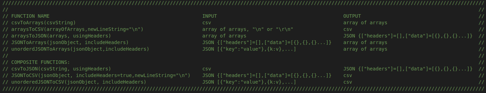

# CSV and JSON Converters

## For reading CSV to JSON or Array of Arrays and also for converting JSON to CSV and CSV to JSON etc.

1) Functions produce CSV with cells as strings in quotations.

2) CSV is converted to array of arrays as strings.

3) Functions produce JSON object with "headers" and "data" because JSON is not ordered like CSV.

4) Arrays of JSON objects can be made into CSV.

5) When reading in CSV, if CSV contains a header, array of arrays will contain a header.

6) When converting to/from JSON to arrays or CSV will need to specify if headers are being used.

7) See screenshot for a list of the input and output formats of the data structures.

## The following rules apply regarding CSV "format"

1) When CSV is produced, all cells are quoted (but non-quoted CSV can be read in from external sources)

2) Interior double quotes ie " are converted to ""

3) The CSV lines are split by the newline character "\n", so long as it is not in the interior of a cell.  

4) If the "\n" is in a cell, it should be inside quotations, else it will be interpreted as a new line.

## New change 10/5/2022

Now you can make the CSV with CR+LF (Carriage Return + Line Feed), instead of just LF or new line.
Some programs like MS Outlook will use 2 characters like "\r\n" instead of unix like new lines like "\n".
This will allow you to write CSV that can be read in by programs that require this.  I ran into a problem
trying to import some csv into Outlook so I made this modification.

When using in reverse, ie reading in csv using "\r\n" as the end of line string and converting to JSON or
an array of arrays, it will detect the "\n" and do away with the extra "\r" when converting.
